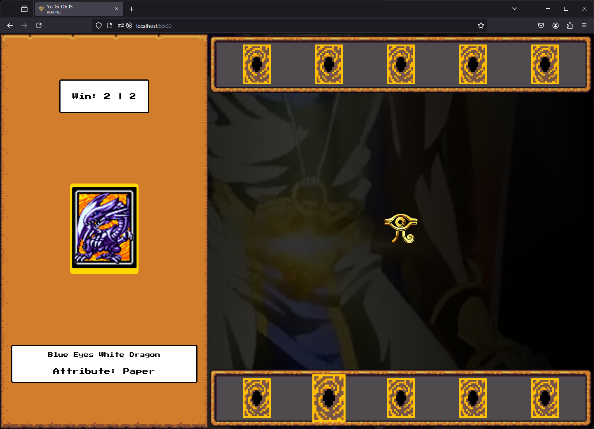

# Criando um Jogo de Cartas do Yu-Gi-Oh! com JavaScript e CSS

Implementação de um jogo jokenpô utilizando a temática Yu-Gi-Oh.

## Funcionamento ⚙️

O jogador seleciona 1 de 5 cartas aleatórias e compara com uma carta aleatória da máquina:

- Tipo `Rock` vence `Scissors`;
- Tipo `Scissors` vence `Paper`;
- Tipo `Paper` vence `Rock`;

## Tecnologias Utilizadas 💻

- HTML: Estrutura da página.
- CSS: Estilização das cartas e layout geral do jogo.
- JavaScript: Lógica do jogo.

## Como Rodar 🕹️

1. Clonar ou Baixar o repositório.
2. Executar o arquivo `index.html` no navegador para jogar.
